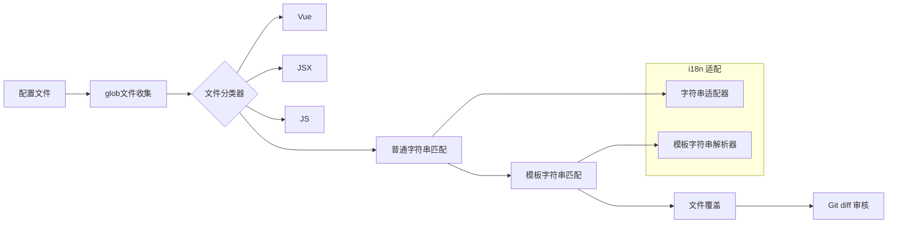

# i18nation

```mermaid
graph LR
    配置文件 --> glob文件收集
    glob文件收集 --> 文件分类器{文件分类器} --> Vue
    文件分类器 --> JSX
    文件分类器 --> JS
    文件分类器 ----> 普通字符串匹配 
    普通字符串匹配 ---> 模板字符串匹配

    普通字符串匹配 ---> 字符串适配器
    模板字符串匹配 ---> 模板字符串解析器

    subgraph i18n 适配
    字符串适配器
    模板字符串解析器
    end

    模板字符串匹配 ---> 文件覆盖 ---> Git[Git diff 审核] 
```
