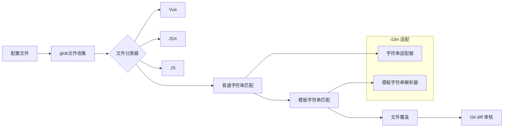

# i18nation

-   [x] style、class、href 不需要进行抽取
-   [x] script、style、code 标签不需要进行抽取
-   [x] url 不进行抽取
-   [x] #000000 色彩不进行提取
-   [x] .woff2 不进行抽取
-   [x] 数字% 不进行抽取
-   [x] 空字符串、标点符号不抽取
-   [x] html 注释避让
-   [x] 尽量维持原始引号
